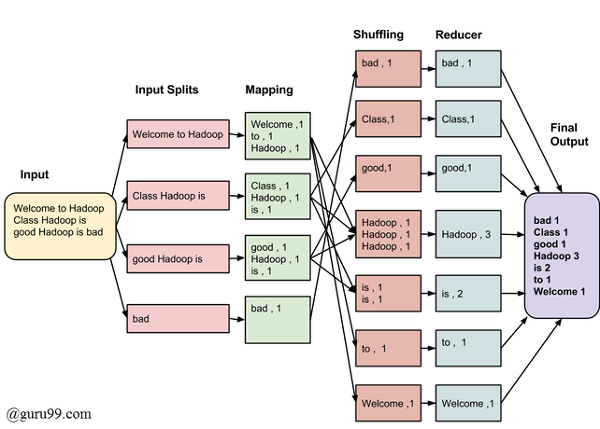

# WordCount in Go

## 프로젝트 개요
`GoWordCounter`는 Go 언어로 작성된 텍스트 파일에서 단어 빈도수를 계산하는 프로그램입니다. 이 프로그램은 고루틴을 활용하여 텍스트 파일을 효율적으로 처리하고, 각 단어의 출현 빈도를 계산합니다.

## 설치 방법
프로그램을 실행하기 위해서는 Go 언어가 시스템에 설치되어 있어야 합니다. Go의 설치 방법은 [Go 공식 홈페이지](https://golang.org/doc/install)를 참조하세요.

## 사용 방법
프로그램을 사용하기 위해서는 다음 단계를 따르세요:

1. 이 저장소를 클론하거나 다운로드합니다.
2. 커맨드 라인 또는 터미널을 열고, 소스 코드가 있는 디렉터리로 이동합니다.
3. 다음 명령어를 실행하여 프로그램을 컴파일합니다:
   ```
   go build wordcount.go
   ```
4. 다음과 같이 프로그램을 실행합니다:
   ```
   ./wordcount <파일경로>
   ```
   여기서 `<파일경로>`는 단어 빈도를 계산하고자 하는 텍스트 파일의 경로입니다.

## 프로그램 구조


다음과 같은 Hadoop의 Map Reduce 과정을 고루틴과 채널을 사용하여 인메모리에서 구현하였습니다.
- `main`: 프로그램의 진입점, 파일 읽기 및 고루틴 관리를 담당합니다.
- `inputSplits`: 주어진 파일을 읽고 내용을 줄 단위로 분리합니다.
- `extractWords`: 각 줄에서 단어를 추출하고 소문자로 변환합니다.
- `mapShuffleReduce`: 각 줄에 대한 단어 빈도를 계산하고 결과를 채널을 통해 전송합니다.

## 기술 스택
- Go 언어
- 동시성 처리(고루틴, 채널)

## 라이선스
이 프로젝트는 [MIT 라이선스](LICENSE) 하에 배포됩니다.
